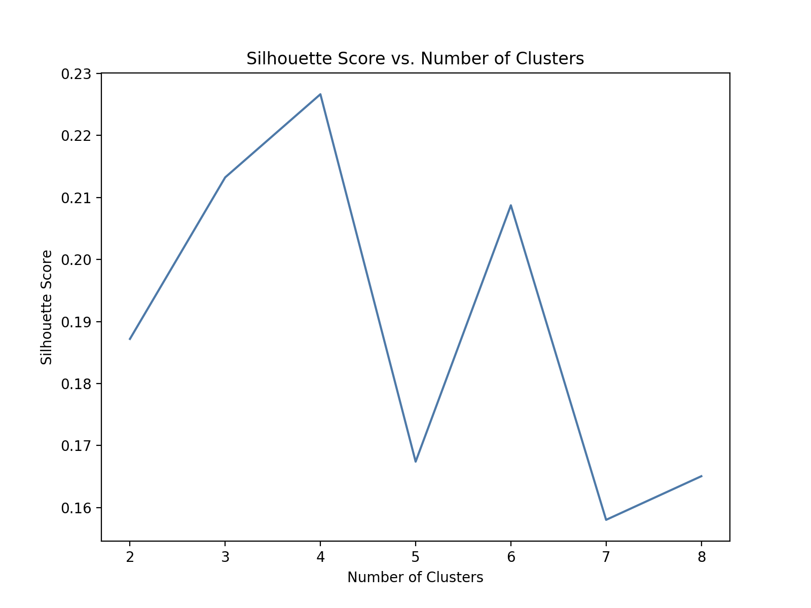
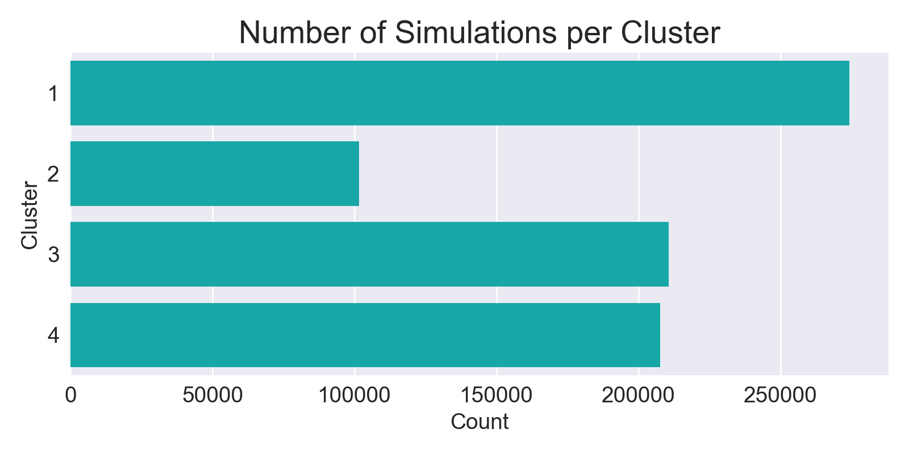
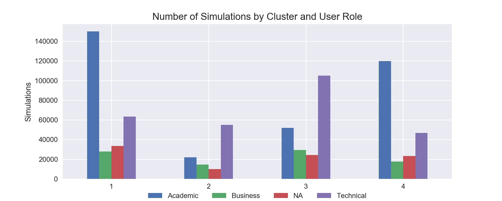
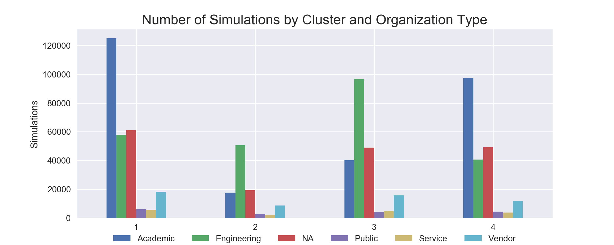
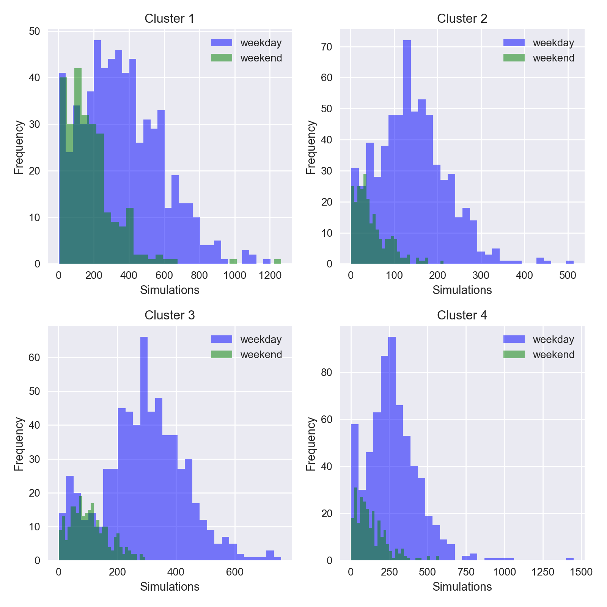
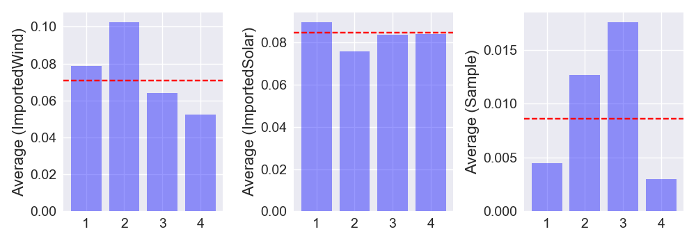
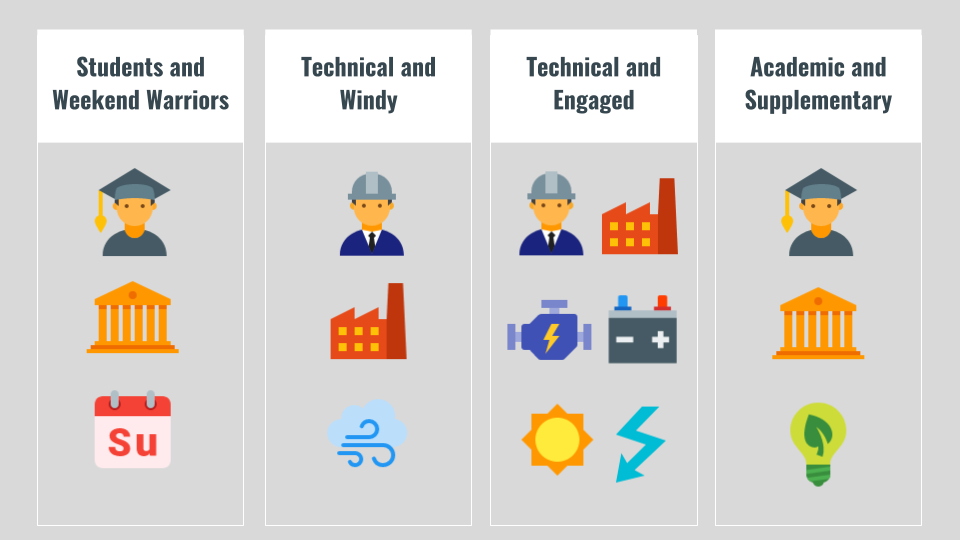

## Microgrid Customer Segmentation  
### Problem Statement
[HOMER Energy](http://www.homerenergy.com/) is a world leader in accurately modeling microgrid optimization. The HOMER (Hybrid Optimization of Multiple Energy Resources) software allows users to understand how to build cost effective and reliable microgrids that combine traditionally generated and renewable power, storage, and load management. HOMER Energy also offers software training, microgrid consulting expertise, and market access support to its vendor partners.

As the microgrid market continues to expand, HOMER and its vendor partners need to better understand its software users' behavior and intentions. **The objective of this study is to extract structure and meaning from HOMER Energy's collection of user software simulations.** By being able to segment its customer base, HOMER can enhance the market access branch of its business model by providing its vendor partners with more reliable information related to the microgrid consumer market. Understanding which software users are more likely to initiate microgrids is information all vendors want to know to better target those consumers who are ready to get started.

### Process
#### Data Preprocessing
The first step in this process was to understand the data and prepare it for modeling. The HOMER software is extremely powerful and capable of modeling hundreds of microgird configurations at once. Because the software has predictive capabilities built into it, my task was to understand which features in the data space would be insightful for determining the realness or seriousness of a project. Initial features were selected based on consultations with my HOMER counterpart, Jordan Esbin, as well as my participation in HOMER's online software training series. After selecting the appropriate user input features, I performed a variety of data munging and cleaning steps using the Pandas data analysis library. For example, I bucketed the User Role and Organization Type variables into categories such as academic, business, technical, and undefined, and categorized whether or not a simulation modeled certain types of energy hardware. This extensive data cleaning step reduced the features space from 144 variables to 17. Final model features include:

| Feature   | Description | Data Type |
| -------   | ----------- | --------- |
| User | Six-digit numeric ID for each user | String |
| UserRole | User identified professional occupation | String |
| OrganizationType | User identified employment field | String |
| Latitude | Latitude coordinate of simulated project | Float |
| Longitude | Longitude coordinate of simulated project | Float |
| MultiGenSearch | If applicable, if the user simulated a variety of generator models | Category |
| MultiWindSearch | If applicable, if the user simulated a variety of wind turbine models | Category |
| MultiBatSearch | If applicable, if the user simulated a variety of battery quantities | Category |
| MultiPvSearch | If applicable, if the user simulated a variety of solar panel configurations | Category |
| MultiConSearch | If applicable, if the user simulated a variety of converter configurations | Category |
| DefaultGenerator | If applicable, if the user used the default generator model in the simulation | Category |
| Sample | Whether a sample file was used in the simulation | Boolean |
| ImportedWind | If the user opted to import wind data in lieu of using the default parameters | Boolean |
| ImportedSolar | If the user opted to import solar data in lieu of using the default parameters | Boolean |
| Country | Country of the simulated project | Category |
| FIPS | Federal Information Processing Standards (FIPS) code for U.S.-based simulations | String |

#### Model Development
Because HOMER does not currently have a way of tracking which of its software users have become microgrid implementers, I explored various unsupervised clustering algorithms to model the underlying structure of the data. K-means is a common clustering algorithm that groups data according to existing similarities. However, because the similarity metric used in k-means is the computed euclidean distance between each data point and the centroids of each cluster, the k-means algorithm is not appropriate for non-numerical data. A more appropriate clustering algorithm is **k-modes**. K-modes is an extension of k-means, however, instead of calculating distance, it quantifies the total number of mismatched categories between two objects: the small the number, the more similar the two objects. In addition, k-modes uses modes instead of means, in which the mode is a vector of elements that minimizes the dissimilarities between the vector and an individual data point.

Other unsupervised clustering algorithms were also tested on the data, including **hierarchical agglomerative clustering** and **gaussian mixture models**. To test these algorithms, I used one-hot encoding to further transform the feature space into binary/dummy variables. Both algorithms produced clustered results, however, the interpretability of the clusters was compromised due to the inherent non-numerical nature of the data. For this reason, I settled on k-modes as the algorithm to formulate my findings. You can read more about k-modes clustering in Zhexue Huang's [reasearch paper](http://arbor.ee.ntu.edu.tw/~chyun/dmpaper/huanet98.pdf) on the topic.

Once the cluster algorithm was selected, I needed to determine the appropriate amount of clusters to segment the data. In k-means clustering, it is common to perform a dimensionality reduction technique such as principle component analysis (PCA) to plot the resulting clusters in a two dimensional space to visually confirm clustering is taking place. However, because applying PCA to categorical data is generally regarded as unwise, I instead opted to calculate a silhouette score based on a hamming distance metric for a range of cluster quantities to settle on the most appropriate number of customer segments.  When calculating the silhouette coefficient, the best possible value is 1, indicating all data points are perfectly grouped and there are no overlapping clusters. A coefficient of 0 implies overlapping clusters, and negative values suggest that a sample has been assigned to the wrong cluster. Based on the below plot of scores, I decided to cluster my data into four clusters. I selected k=4 because the silhouette score was the highest for this number of clusters, and it made intuitive sense based on my understanding of HOMER's customer base.

<!--  -->

After selecting the appropriate number of clusters, I fitted the k-modes clustering algorithm to the data and assigned cluster labels to each simulation. I then performed exploratory data analysis to begin extracting meaningful business intelligence from the clusters.

#### Exploratory Data Analysis
Before examining each cluster, I gathered a baseline understanding of the user make-up of the simulations. The breakdown of simulations by user type is shown below.

UserRole | Count | Total%
---------|-----:|-----:
Academic |343488| 43.25
Technical|270195| 34.02
NA       | 91185| 11.48
Business | 89385| 11.25

As is evident from the tables above, the majority of simulations are run by academic professionals or by an academic institution. On the whole, HOMER does not consider academic users to be as likely to become real microgrid implementers as other user types.

OrganizationType | Count | Total%
-----------|-----:|-----:
Academic   |280350| 35.30
Engineering|246032| 30.98
NA         |178858| 22.52
Vendor     | 54742|  6.89
Public     | 17726|  2.23
Service    | 16545|  2.08

After assigning cluster labels to each user using k-modes, we can see that the total number of simulations is fairly well distributed among the four clusters, with a larger share going to Cluster 1 and a smaller share to Cluster 2.

<!--  -->

Looking at the distribution of user roles in each cluster, we can see that the model has split the user roles into particular clusters, but not exclusively into just one. Academic users are the majority it in Clusters 1 and 4, and technical users are more prevalent Clusters 2 and 3.

<!--  -->

Similarly, the distribution of organization type among the clusters aligns closely with the user role distributions. Academic institutions are the majority in Clusters 1 and 4, and engineering firms are most common in Clusters 2 and 3.

<!--  -->

To explore and extract additional information from the data, I also created weekday and weekend histograms of the number of simulations per day for each cluster. The resultant graphs suggest similar, but subtle differences between the four groups. While the number of simulations per day is on average highest during the week for all four clusters, we can see from the histograms for Cluster 1 that the frequency of simulations on the weekend does not differ as severely as compared to the other three groups. This could be due to the fact that there is large majority of academic users in this cluster, and students are more likely to run simulations over the weekend for school projects. Building on this analysis, Cluster 4, which also has a majority of academic users and organizations, appears to have relatively high kurtosis due to a few extreme deviations (outliers). While the weekend simulations seem to be infrequent in Cluster 4, there are a handful of days in which the cumulative sum of simulations have reached into the thousands. The true nature of these simulations likely requires further analysis to determine if the simulations are being run with project implementation in mind, or as part of academic research endeavor. Clusters 2 and 3 also suggest minimal weekend software usage, with Cluster 3 depicting a distribution suggestive of more model runs per day.

<!--  -->

Diving deeper into the number of simulations by cluster, the table below provides some insight into the frequency and variability at which users are interacting with the software in each cluster. Users in Cluster 1 have the highest average number of simulations, with Clusters 3 and 4 not far behind. Cluster 1 also has the greatest standard deviation, suggesting users in this cluster have the greatest variability in their interaction with the software. Users in Cluster 2 have the lowest average number of simulations, as well as the smallest standard deviation. It may be appropriate to classify these (on average) technical users as exploring the software's functionality, but not relying on it to extract actionable insights.

Metric|Cluster 1|Cluster 2|Cluster 3|Cluster 4
-----|--------:|--------:|--------:|--------:
mean |    14.61|     5.42|    11.23|    11.06
std  |    73.40|    35.28|    65.24|    50.44
max  |  3831.00|  1512.00|  3621.00|  2276.00

Other important input variables identified by HOMER are whether a user has imported his/her own wind or solar location metrics, and whether a user opts to use HOMER's default sample file. The act of importing more precise weather data is viewed favorably in regards to the user's seriousness of turning a simulation into a real project. Similarly, HOMER does not consider a simulation run using its default sample file to correlate with project realness.  

The below bar graphs show the mean feature usage for imported solar, imported wind, and sample file in each cluster. For imported wind, we see that Cluster 2 simulations are the most likely to import this data, with just over 10 percent of simulations using imported wind data. For imported solar, all four clusters have a similar mean average for importing geographic-specific data. Interestingly enough, Clusters 2 and 3, the groups with the greatest proportion of technical users, have the highest average for using HOMER's sample file to run simulations. While HOMER considers the use of the sample file to be a negative indicator of simulation realness, it should be noted the relative usage in these clusters is still low at 1.25 and 1.75 percent of the time, respectfully.

<!--  -->

HOMER also considers the extent to which a simulation models a variety of microgrid parameters and configurations as a strong indicator of the simulation's realness. For each simulation, a user is able to specify what energy hardware (e.g. batteries, turbines, solar panels, etc.) she would like to model, as well a range of hardware specifications for the software to compare and output an optimized microgrid (optimization is defined by the the lowest net present cost of microgrid system). Per conversations with HOMER, a rough metric to judge a simulation's realness is whether the user provides more than two different hardware specifications to test. For this reason, I crafted a series of features that check whether a user modeled a certain piece of hardware, and if so, if the simulation tested multiple specifications/capacities for that particular hardware category.

For generators, the breakdown of simulations that modeled generators, and if more than two generator sizes were tested is as follows:  
**Key:**  
True = generator modeled and more than two sizes tested   
False = generator modeled, but less than two sizes tested  
NA = no generator modeled

MultiGenSearch |Cluster 1: Count|Cluster 1: Total%|Cluster 2: Count|Cluster 2: Total%|Cluster 3: Count|Cluster 3: Total%|Cluster 4: Count|Cluster 4: Total%
-----|---------------:|----------------:|---------------:|----------------:|---------------:|----------------:|---------------:|----------------:
True |           34342|            12.52|           12160|            11.96|           55652|            26.41|             NaN|              NaN
False|          239961|            87.48|           68544|            67.43|          101971|            48.40|             NaN|              NaN
NA   |             NaN|              NaN|           20951|            20.61|           53069|            25.19|          207603|              100

For wind turbines:  

MultiWindSearch |Cluster 1: Count|Cluster 1: Total%|Cluster 2: Count|Cluster 2: Total%|Cluster 3: Count|Cluster 3: Total%|Cluster 4: Count|Cluster 4: Total%
-----|---------------:|----------------:|---------------:|----------------:|---------------:|----------------:|---------------:|----------------:
True |           23771|             8.67|            6538|             6.43|           45076|            21.39|           19473|             9.38
False|           72393|            26.39|           14933|            14.69|           17282|             8.20|           39446|            19.00
NA   |          178139|            64.94|           80184|            78.88|          148334|            70.40|          148684|            71.62

For batteries:  

MultiBatSearch |Cluster 1: Count|Cluster 1: Total%|Cluster 2: Count|Cluster 2: Total%|Cluster 3: Count|Cluster 3: Total%|Cluster 4: Count|Cluster 4: Total%
-----|---------------:|----------------:|---------------:|----------------:|---------------:|----------------:|---------------:|----------------:
True |           47458|            17.30|            4908|             4.83|          180294|            85.57|           53537|            25.79
False|          192038|            70.01|            8491|             8.35|           17840|             8.47|           96982|            46.72
NA   |           34807|            12.69|           88256|            86.82|           12558|             5.96|           57084|            27.50

For solar panels (PV):  

MultiPvSearch |Cluster 1: Count|Cluster 1: Total%|Cluster 2: Count|Cluster 2: Total%|Cluster 3: Count|Cluster 3: Total%|Cluster 4: Count|Cluster 4: Total%
-----|---------------:|----------------:|---------------:|----------------:|---------------:|----------------:|---------------:|----------------:
True |           52175|            19.02|           18130|            17.83|          180702|            85.77|           61286|            29.52
False|          198295|            72.29|           24919|            24.51|           20660|             9.81|          126397|            60.88
NA   |           23833|             8.69|           58606|            57.65|            9330|             4.43|           19920|             9.60

For converters:  

MultiConSearch |Cluster 1: Count|Cluster 1: Total%|Cluster 2: Count|Cluster 2: Total%|Cluster 3: Count|Cluster 3: Total%|Cluster 4: Count|Cluster 4: Total%
-----|---------------:|----------------:|---------------:|----------------:|---------------:|----------------:|---------------:|----------------:
True |           31383|            11.44|            3688|             3.63|          151055|            71.69|           38973|            18.77
False|          229500|            83.67|           12524|            12.32|           52750|            25.04|          138527|            66.73
NA   |           13420|             4.89|           85443|            84.05|            6887|             3.27|           30103|            14.50

#### Cluster Profiles

The below table provides an overview of general characteristics observed in each of the four clusters.

### Mapping Simulations

Please see the [web application](http://ec2-52-200-8-2.compute-1.amazonaws.com:8105/#) developed for this project to create a county-by-county heat map of the United States and marker cluster map of any country in the world for each of the four clusters.

### Next Steps
Segmenting simulation runs is an important first step in understanding who is using HOMER's software and where its partners can best focus their marketing and outreach. A close look at the four clusters illuminates distinct characteristics that suggest a varying degree of seriousness or interest from the user. While this information can be immediately helpful in targeting the right users, further exploration and model tuning will certainly add value and precision to determining the realness of a simulated project. Below are a few suggestions of ways to expand upon the findings of this project:   
- A review of feature importance would likely result in new or adjusted model variables that could lead to more robust clustering. Furthermore, applying a heuristic weight to each simulation and exploring graph theory to model pairwise relationships between observations is a possible way to arrive at a 'realness' metric.
- The project currently aggregates three years of software simulations. Exploring ways to incorporate methods that further slice the data and outcomes into time segments would likely prove useful to better understand the relevancy and timeliness of simulations.
- It is recommended that HOMER begin surveying its software users to learn the intentions and outcomes of the simulations. With this new data HOMER can begin to explore powerful predictive models that will present internal and external analytical opportunities.
- While mapping the various cluster simulations in different countries, it was observed that repeated simulations were often run close to airports. This behavior makes sense given the need for all airports to maintain constant connectivity. It is recommended that HOMER and/or its supply partners explore direct marketing to airports who through multiple simulations have shown interest in establishing supplemental energy resources or standalone microgrids.

### Technology Stack
The following software packages and technologies were used in this project.

<!--  -->

### Project Development Outline
Phase 1: Problem Framing - Complete
- Meet and consult with HOMER Energy counterpart
- Identify need
- Succinctly frame problem
- Outline approach and data pipeline  
- **Work product:** Clear project objective

Phase 2: Data Munging - Complete
- Determine strategy for missing values
- Select initial features and identify areas of data sparsity
- Subset data, as necessary  
- **Work product:** Dense data frame suitable for EDA and modeling

Phase 3: EDA and Modeling - Complete
- Apply unsupervised clustering algorithms to data frame
- Visualize data subsets to identify trends
- Identify additional data sources to incorporate into model  
- **Work product:** Initial models, visualizations, additional data

Phase 4: Final Model and Feature Importance - Complete
- Run and save k-modes model, append cluster labels to data frame
- Select the proper number of clusters based on silhouette scoring
- Explore visualizations and feature importance methods for categorical datasets (e.g. Multiple Correspondence Analysis)
- **Work product:** Working model with supporting visualizations to infer business intelligence

Phase 5: Web Application and Presentation - Current
- Build Flask application to deploy on Amazon Web Services
- Present findings and application at Galvanize and HOMER Energy
- Outline next steps

### Contact
Please contact me with questions or comments at <sdking49@gmail.com>.

### Web Application
You can also explore the flask application for this project [here](http://ec2-52-200-8-2.compute-1.amazonaws.com:8105/#).

### References
- “Extensions to the k-Means Algorithm for Clustering Large Data Setswith Categorical Values" by Zhexue Huang:
http://arbor.ee.ntu.edu.tw/~chyun/dmpaper/huanet98.pd  
- Python implementation of k-modes clustering algorithm for categorical data: https://github.com/nicodv/kmodes#id1  
- HOMER Energy: http://homerenergy.com/
